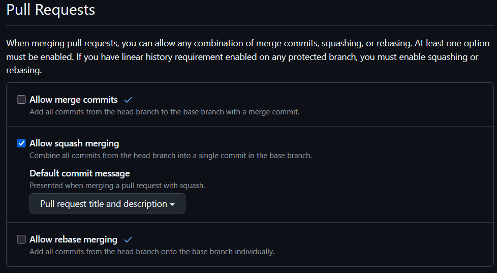

# Recommended Github Repo Settings

## Using Pull Requests to Document Code Change History

Use pull requests for all changes to the codebase. Not only does this make changes safer, especially with regards to CI checks, but it also provides a clear history of changes made to the codebase. This is particularly useful for understanding the evolution of the code because it allows you to see what changes were made, when, and by whom. More than just `git blame`, many IDEs provide a way to view the history of the PR, including the discussions and commits that led to the final merged PR. This is invaluable not only for remembering your own work, but for documenting the codebase for others. *Even if you are working on a project alone, using a PR approach will prove invaluable at times.*

## Opinionated Repo Settings

Use only Squash and Merge to keep a clean commit history. Use PR title and description to document the merge commit. Again, blame will allow you to find the PR and its discussion.



You may also like:

- Always suggest updating pull request branches: Adds a button to update a PR with content from main -- useful for new contributors.
- Automatically delete head branches: Automatically deletes the branch after merging a PR.

## Branch Protection Rules

Set up branch protection rules to ensure that the main branch is protected from direct pushes, especially when you may accidentally push and break things that people rely on! Instead require all changes to go through a PR.

In Repo Settings -> Rulesets.

1. Name and activate a ruleset
2. Protect the default branch (`main`).
3. Leave on the default settings
4. Turn on "Require a pull request before merging". Use settings appropriate for yourself or team.
5. Read through the rest of the settings and determine if they are appropriate for your project.

Trying to push to main will result in

```bash
C:\Users\Tim\teaching\urssi-docs>git push
Enumerating objects: 14, done.
Counting objects: 100% (14/14), done.
Delta compression using up to 12 threads
Compressing objects: 100% (10/10), done.
Writing objects: 100% (13/13), 58.66 KiB | 8.38 MiB/s, done.
Total 13 (delta 0), reused 0 (delta 0), pack-reused 0 (from 0)
remote: error: GH013: Repository rule violations found for refs/heads/main.
remote: Review all repository rules at https://github.com/TimMonko/urssi-docs/rules?ref=refs%2Fheads%2Fmain
remote:
remote: - Changes must be made through a pull request.
remote:
To https://github.com/TimMonko/urssi-docs.git
 ! [remote rejected] main -> main (push declined due to repository rule violations)
error: failed to push some refs to 'https://github.com/TimMonko/urssi-docs.git'
```
